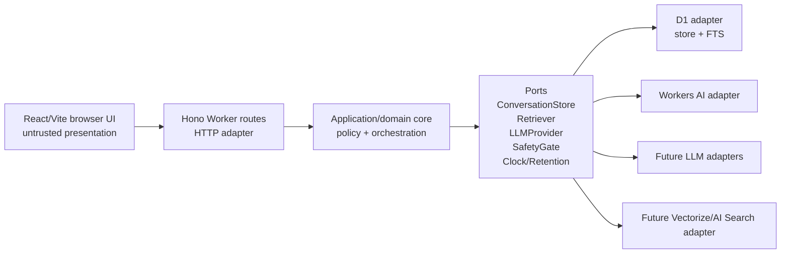
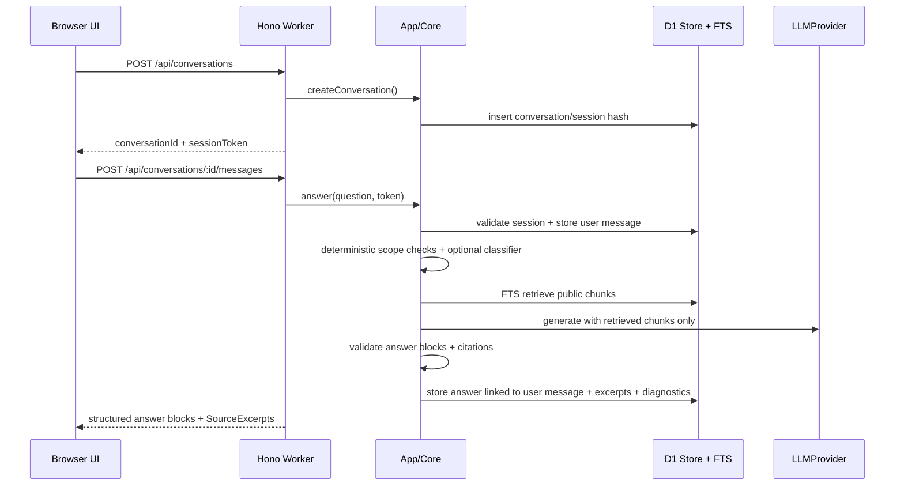
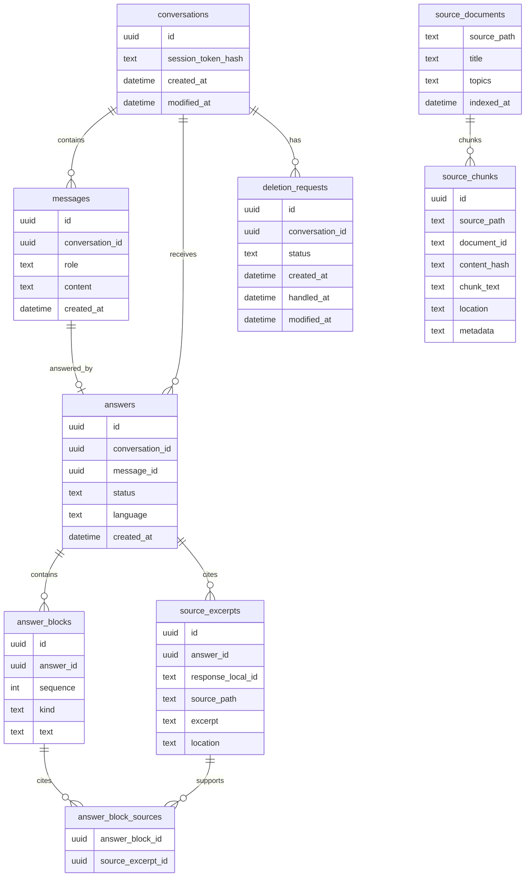
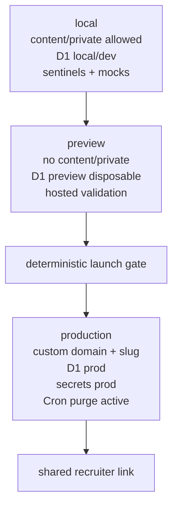

# Architecture Spine — Candidate Copilot V1

## Design Paradigm

Candidate Copilot V1 is a **lightweight hexagonal / ports-and-adapters serverless monolith**.



Business rules, safety rules, answer contracts, retrieval orchestration, retention rules, and provider selection live in application/domain code. Cloudflare services, Hono route handlers, provider SDKs, and browser code are adapters.

## Invariants & Rules

### AD-1 — Business core is portable; Cloudflare is an adapter

- **Binds:** all FRs; implementation units for Worker routes, storage, retrieval, LLM, safety, retention
- **Prevents:** route handlers, Cloudflare bindings, provider SDKs, or browser code becoming the owner of product policy
- **Rule:** Implement business decisions in application/domain services behind ports. Hono, D1, Workers AI, Pages, future Vectorize/AI Search, and external LLM providers may implement ports but must not define grounding, privacy, retention, refusal, or launch policy.

### AD-2 — Public Knowledge Base is versioned public Markdown only

- **Binds:** FR-9, FR-10, FR-16, FR-21, FR-22
- **Prevents:** private drafts, D1 indexes, or runtime artifacts becoming the source of truth for public evidence
- **Rule:** `content/public/**/*.md` is the only versioned, deployed, indexable Public Knowledge Base. `content/private/` is local-only, gitignored, and excluded from preview/production build contexts. Promotion means human+AI editorial review/edit followed by copying approved Markdown into `content/public`.

### AD-3 — Backend owns the answer pipeline; browser is untrusted

- **Binds:** FR-5..FR-20; security, privacy, reliability NFRs
- **Prevents:** client-side grounding bypass, tampered excerpts, duplicate answer ownership, and unverifiable deletion/retention behavior
- **Rule:** The Worker owns scope validation, retrieval, prompt assembly, LLM invocation, response shaping, conversation persistence, deletion-request persistence, throttling, timeout handling, quota fallback, and post-generation validation. The browser only presents UI, submits input, stores current `conversationId` + opaque `sessionToken` in `sessionStorage`, and renders server-returned data.

### AD-4 — D1 is canonical runtime state

- **Binds:** FR-5, FR-6, FR-10, FR-16..FR-22
- **Prevents:** browser-owned transcripts, opaque runtime state, and uncontrolled client-side mutation
- **Rule:** Conversations, messages, answer records, cited Source Excerpts, deletion requests, minimal diagnostics, retention-relevant timestamps, and the FTS retrieval index derived from `content/public` live in D1. The browser never owns canonical transcript, citation, deletion, or retention state.

### AD-5 — Answers are block-structured with paragraph-level evidence

- **Binds:** FR-7, FR-10, FR-11, FR-12, FR-14, FR-15, FR-21, FR-22
- **Prevents:** vague whole-answer citation lists, frontend-invented citations, and unsupported factual paragraphs
- **Rule:** Worker responses use structured answer blocks. Each factual paragraph/block must carry one or more response-local `SourceExcerpt` ids. The block-to-excerpt edges are canonical persisted data, not merely UI decoration. Unsourced blocks are allowed only for transitions, limitations, refusals, or professional failure messages. `SourceExcerpt.sourcePath` must be under `content/public/` and include enough location metadata for diagnostics.

### AD-6 — Safety gates run before retrieval and after generation

- **Binds:** FR-11..FR-15, FR-21, FR-22; abuse/security NFRs
- **Prevents:** the answer LLM becoming sole authority on whether a question may be answered, and Knowledge Base content leaking into scope classification
- **Rule:** The Worker first applies deterministic limits/rules and, when needed, a small LLM scope classifier that sees only the current question plus minimal same-conversation context and no Knowledge Base content. Only allowed professional/documented-scope questions proceed to retrieval. After generation, the Worker validates sourced factual blocks and absence of prohibited/error/private content; unsafe, unsupported, quota-exhausted, or classifier-failed paths fail closed with professional partial/refusal/failure output.

### AD-7 — V1 retrieval is D1 FTS over deterministic Markdown chunks

- **Binds:** FR-9, FR-10, FR-11, FR-21, FR-22; simplicity/cost NFRs
- **Prevents:** vector-database complexity, opaque retrieval, and LLM citation outside retrieved public chunks
- **Rule:** V1 chunks `content/public` Markdown deterministically, indexes text plus public metadata in D1 SQLite FTS, and passes only ranked retrieved chunks as the eligible Source Excerpt pool. Indexer, retriever, launch gate, answer service, and operator exports share one canonical source-document/source-chunk metadata contract: source path, document identity, chunk identity, content hash, public frontmatter, and location. No vector database or embeddings in V1. Vectorize/AI Search or other semantic retrieval is deferred until launch tests prove FTS insufficient.

### AD-8 — LLM providers are replaceable and failure-tolerant

- **Binds:** FR-8, FR-11, FR-15, FR-21, FR-22; zero-euro and reliability NFRs
- **Prevents:** product correctness depending on one free quota, random free-router behavior, or provider-specific SDK policy
- **Rule:** Use a replaceable `LLMProvider` port. Workers AI is the default Cloudflare adapter; OpenRouter/Groq/other app-legal providers may be added behind the same port. Provider quota exhaustion, model unavailability, latency timeout, or policy uncertainty must produce a professional refusal/partial/failure path, not raw errors or unsupported answers.

### AD-9 — Public access is unlisted, anonymous, and not authentication

- **Binds:** FR-5, FR-16, FR-21, FR-22; abuse/simplicity NFRs
- **Prevents:** login friction, account-like recruiter tracking, broad accidental discovery, and false reliance on a guessable URL as security
- **Rule:** V1 uses a custom-domain route with an easy human-readable slug plus `noindex`/robots controls and Worker-side abuse/quota limits. The slug reduces accidental discovery and sharing friction but is not a security boundary.

### AD-10 — V1 public API is minimal and token-scoped

- **Binds:** FR-5, FR-6, FR-17, FR-18, FR-19, FR-21, FR-22
- **Prevents:** public listing/search of conversations, cross-conversation access, browser-owned transcript state, and unintended 90-day visitor-side history restoration
- **Rule:** Expose only `POST /api/conversations`, `GET /api/conversations/:id`, `POST /api/conversations/:id/messages`, `POST /api/conversations/:id/deletion-request`, and `GET /api/health`. Conversation creation returns `conversationId` plus opaque `sessionToken`; the Worker validates the token for all conversation operations and returns only that conversation. Each user message creates a turn identity that pairs the stored user message, answer, answer blocks, and excerpts; this pairing is persisted by `answers.message_id` referencing `messages.id`, with one canonical answer per user message in V1. Concurrent message posts for the same conversation must be rejected, serialized, or idempotently correlated so transcripts remain pairable. No admin endpoint, no public conversation listing, no token in URL, no durable `localStorage` restore.

### AD-11 — Operator access is local CLI/script only in V1

- **Binds:** FR-19, FR-20, FR-21, FR-22; security/privacy NFRs
- **Prevents:** public admin attack surface, admin-dashboard scope creep, and account-like recruiter management
- **Rule:** BC reviews retained conversations, deletion requests, diagnostics, exports, and manual deletions through controlled local operator CLI/scripts against Cloudflare/D1. V1 has no public admin dashboard and no admin HTTP endpoint.

### AD-12 — Retention is policy-based on `created_at`; purge is automatic

- **Binds:** FR-16, FR-19, FR-20, FR-21, FR-22; privacy/operations NFRs
- **Prevents:** stale per-row expiry policy, manual-only retention compliance, and loss of deletion-request monitoring
- **Rule:** Runtime tables use `created_at` as retention source of truth; retention duration is policy in application/job code, not per-row `expires_at`. Mutable tables carry `modified_at`, maintained by D1 `AFTER UPDATE` triggers or application code. A scheduled Worker/Cron purge job automatically deletes raw and derived conversation data older than the configured retention window; an operator CLI can run the same purge. `deletion_requests` uses `created_at`, `status`, `handled_at`, and `modified_at`, stores metadata only, and is retained indefinitely. Deletion-request status values and transitions are owned by application/operator code, exported for monitoring, and covered by the launch gate; BC must set an operator review cadence before production sharing.

### AD-13 — Launch gate is deterministic and blocking

- **Binds:** FR-9, FR-10, FR-15, FR-16, FR-19..FR-22; launch safety NFRs
- **Prevents:** non-deterministic launch criteria, unpromoted content at runtime, obvious private markers, and silent critical readiness failures
- **Rule:** Recruiter sharing is blocked until a deterministic launch gate passes. The gate verifies `content/private` is gitignored/untracked, build/index inputs and D1 `sourcePath`s are only `content/public`, required public frontmatter is present (`visibility: public`, `created_at`, `reviewed_by`, `reviewed_at`), forbidden editorial markers and machine-detectable secret/contact/path patterns are absent, private sentinels cannot reach build outputs/D1/responses/operator exports, responses cite only `content/public`, host/provider log and AI processing-path disclosures match reality, BC's deletion-request review cadence is configured, and grounding/refusal/privacy/deletion/retention/quota/timeout/raw-error tests pass. The gate does not prove semantic publicness; promotion does.

### AD-14 — Hosted environments are separated by purpose

- **Binds:** FR-5, FR-16, FR-20, FR-21, FR-22; operations/security NFRs
- **Prevents:** private local material reaching hosted environments, preview data confusion, and recruiter exposure before readiness
- **Rule:** Local may contain gitignored `content/private`, dev D1 data, sentinels, mocks, and free-provider tests. Preview excludes `content/private`, uses separate disposable D1/resources, and validates hosted Cloudflare behavior but is not shared with recruiters. Production uses custom domain, production D1/resources, env-separated secrets, and active scheduled purge. D1 migrations and triggers are versioned and applied explicitly per environment.

## Consistency Conventions

| Concern | Convention |
| --- | --- |
| Language | TypeScript full-stack; shared API/domain contract types live outside frontend-only and adapter-only code. |
| UI language | V1 UI copy is French-only; answer language follows the recruiter's question where practical. |
| Styling | Native structured CSS with design tokens; Tailwind deferred. |
| IDs | Conversations use UUIDs; browser session continuity uses a separate opaque `sessionToken`. |
| Timestamps | Use `created_at` on persisted records; use `modified_at` on mutable records; deletion requests add `handled_at` when processed. |
| Public content frontmatter | `visibility: public`, `created_at`, `reviewed_by`, `reviewed_at`; optional public `title`, `topics`, `aliases` for FTS recall. |
| Errors | Public API errors use normalized professional shapes; never expose stack traces, raw provider errors, SQL errors, or hidden prompts. |
| Source paths | Runtime source paths and citations must start with `content/public/`; any other source path is a launch/test failure. |
| Hono usage | Hono routes are thin adapters that parse/validate HTTP, call application services, and serialize responses. |
| Deletion request status | Use one application-owned enum such as `open`, `handled`, `rejected`, `superseded`; status transitions are made only by operator/application paths. |

## Stack

| Name | Version |
| --- | --- |
| Node.js | 24.15.0 |
| npm | 11.12.1 |
| TypeScript | 7.0.2 |
| React | 19.3.0 |
| Vite | 8.3.0 |
| Hono | 4.13.8 |
| Vitest | 5.0.1 |
| Playwright `@playwright/test` | 1.63.0 |
| Wrangler | 4.132.0 |
| Cloudflare Pages | managed service; docs checked 2026-09-11 |
| Cloudflare Workers | managed service; docs checked 2026-09-11 |
| Cloudflare D1 / SQLite FTS5 | managed service; docs checked 2026-09-11 and trigger support checked 2026-09-16 |
| Cloudflare Workers AI | managed service; free quota docs checked 2026-09-11 |

## Structural Seed

```text
candidate-copilot/
  content/
    public/                 # versioned Public Knowledge Base Markdown only
    private/                # gitignored local preparation workspace only
  src/
    shared/                 # API/domain contracts, ids, status/error shapes
    app/                    # application services: answer, safety, retrieval orchestration, retention
    ports/                  # LLMProvider, Retriever, ConversationStore, Clock/Retention
    adapters/
      cloudflare/           # D1 store, D1 FTS retriever, Workers AI provider, scheduled purge
    worker/                 # Hono route adapter and Worker entrypoint
    web/                    # React/Vite UI
    styles/                 # tokens/base/layout/components CSS
  migrations/               # D1 schema, FTS tables, triggers
  scripts/                  # index, launch gate, operator export/delete/purge
  tests/                    # Vitest + Playwright + launch gate fixtures
```

### Runtime flow



### Core data shape



### Deployment envelope



## Capability → Architecture Map

| Capability / Area | Lives in | Governed by |
| --- | --- | --- |
| FR-1..FR-4 landing experience | `src/web`, CSS, `content/public` selected project metadata | AD-2, AD-9, conventions |
| FR-5 anonymous public conversation | Worker API + D1 conversations | AD-3, AD-4, AD-9, AD-10 |
| FR-6 multi-turn questions | app answer service + D1 messages/answers | AD-3, AD-4, AD-10 |
| FR-7 language of question | answer service + LLMProvider | AD-5, AD-8 |
| FR-8 working status | React UI + timeout/error states | AD-3, AD-8 |
| FR-9 public Markdown only | `content/public`, index scripts, D1 source tables | AD-2, AD-7, AD-13 |
| FR-10 Source Excerpts | answer blocks + source excerpts | AD-5, AD-7 |
| FR-11 partial/missing evidence | retrieval + answer validation | AD-5, AD-6, AD-7 |
| FR-12 value-judgment refusal | safety gate + answer service | AD-6 |
| FR-13 commitments/intentions refusal | safety gate + answer service | AD-6 |
| FR-14 sensitive personal refusal | safety gate + answer service | AD-6 |
| FR-15 prompt-injection resistance | safety gate + launch tests | AD-3, AD-6, AD-13 |
| FR-16 retention disclosure/provider path | French UI copy + app config + D1 retention + launch-gate provider/log review | AD-8, AD-12, AD-13, AD-14 |
| FR-17 visible Conversation UUID | React UI + Worker create conversation | AD-4, AD-10 |
| FR-18 new conversation on returning visit | `sessionStorage` token convention | AD-10 |
| FR-19 in-app deletion request | Worker endpoint + D1 deletion_requests + CLI export/monitoring cadence | AD-10, AD-11, AD-12 |
| FR-20 90-day deletion | scheduled purge + D1 created_at | AD-12, AD-14 |
| FR-21 launch test set | launch gate scripts/tests | AD-13 |
| FR-22 block launch on critical failures | launch gate + production sharing rule | AD-13, AD-14 |

## Deferred

| Deferred item | Revisit condition |
| --- | --- |
| Exact custom domain and easy slug (`candidate-copilot.com` vs `.dev`) | When domain ownership/DNS is chosen. |
| Exact Workers AI model(s) and classifier/generator prompt text | During implementation after checking current model availability, quotas, latency, and quality. |
| OpenRouter/Groq/other provider adapters | Only if Workers AI free quota/quality fails launch tests or operational needs. |
| Vectorize/AI Search/semantic retrieval | Only if D1 FTS launch tests show unacceptable recall for representative recruiter questions. |
| Full source document browser/cards | Deferred by PRD; revisit after recruiter use shows Source Excerpts are insufficient. |
| Admin dashboard or admin endpoint | Deferred beyond V1; CLI/script operator access is binding for V1. |
| Automated immediate visitor deletion | Deferred by PRD; V1 deletion is request + manual handling plus automatic 90-day purge. |
| Contact/recruiting-channel UI | Out of scope by PRD. |
| Public KB manifest | Not needed while `content/public` means fully publishable/indexable; revisit if source activation/versioning needs appear. |
| Detailed D1 schema/index definitions | Owned by implementation migrations so long as AD data ownership, timestamp, FTS, and retention rules hold. |
