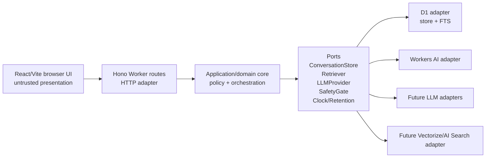
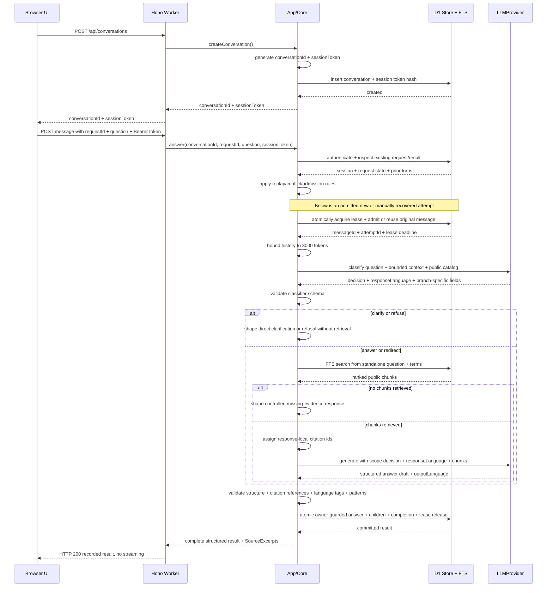
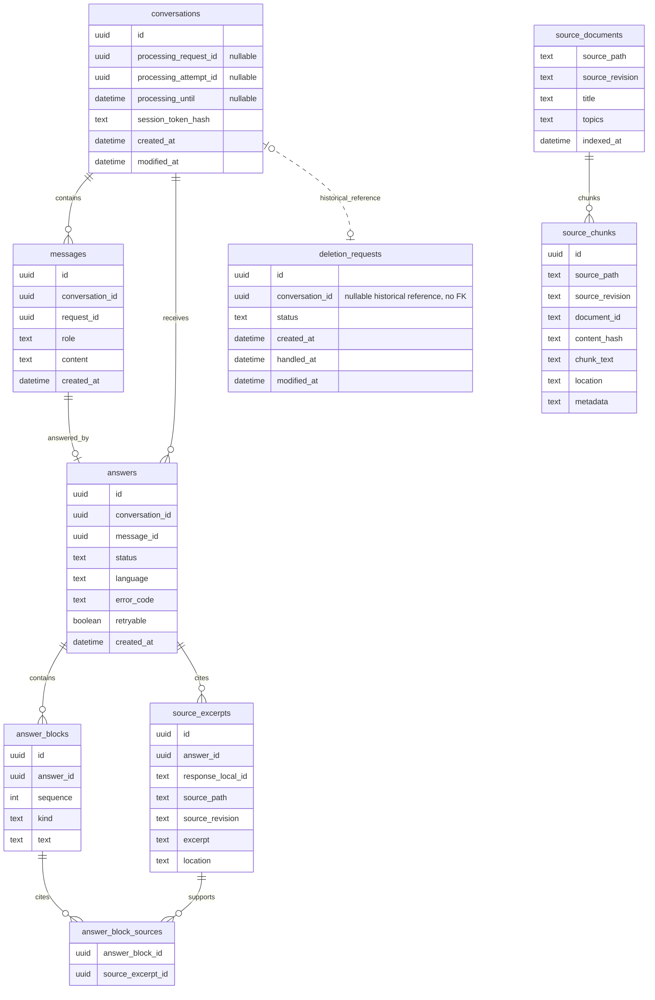
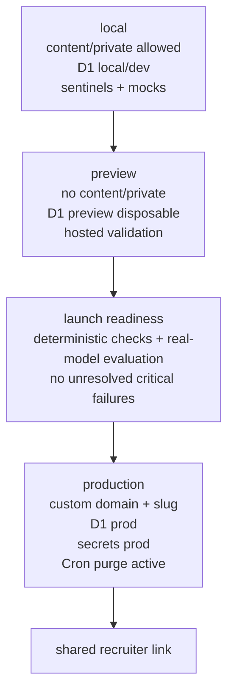
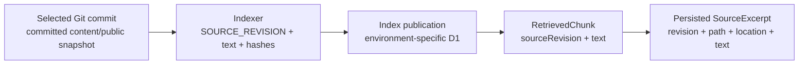

# Architecture Spine — Candidate Copilot V1

Detailed HTTP, recovery, retention, usage-limit, and delivery contracts are binding in [RUNTIME-CONTRACTS.md](RUNTIME-CONTRACTS.md). Implementation stories must preserve both documents; provider-specific quota facts and operational scripts remain explicitly deferred.

## Design Paradigm

Candidate Copilot V1 is a **lightweight hexagonal / ports-and-adapters serverless monolith**.



Business rules, safety rules, answer contracts, retrieval orchestration, retention rules, and provider selection live in application/domain code. Cloudflare services, Hono route handlers, provider SDKs, and browser code are adapters.

## Invariants & Rules

### AD-1 — Business core is portable; Cloudflare is an adapter

- **Binds:** all FRs; implementation units for Worker routes, storage, retrieval, LLM, safety, retention
- **Prevents:** route handlers, Cloudflare bindings, provider SDKs, or browser code becoming the owner of product policy
- **Rule:** Implement business decisions in application/domain services behind ports. Hono, D1, Workers AI, Pages, future Vectorize/AI Search, and external LLM providers may implement ports but must not define grounding, privacy, retention, refusal, or launch policy.

### AD-2 — Public Knowledge Base is versioned public Markdown only

- **Binds:** FR-9, FR-10, FR-16, FR-21, FR-22
- **Prevents:** private drafts, D1 indexes, or runtime artifacts becoming the source of truth for public evidence
- **Rule:** `content/public/**/*.md` is the only versioned, deployed, indexable Public Knowledge Base. `content/private/` is local-only, gitignored, and excluded from preview/production build contexts. Promotion means human+AI editorial review/edit followed by copying approved Markdown into `content/public`.

### AD-3 — Backend owns the answer pipeline; browser is untrusted

- **Binds:** FR-5..FR-20; security, privacy, reliability NFRs
- **Prevents:** client-side grounding bypass, tampered excerpts, duplicate answer ownership, and unverifiable deletion/retention behavior
- **Rule:** The Worker owns scope validation, retrieval, prompt assembly, LLM invocation, response shaping, conversation persistence, deletion-request persistence, throttling, deadlines, quota handling, and post-generation validation. The browser presents UI, submits input, and stores only current-tab/session `conversationId`, opaque `sessionToken`, and temporary `{ requestId, question }` for an unknown-outcome submission in `sessionStorage`; D1 owns the transcript. Model output is untrusted text, not trusted HTML. No automatic processing retries or cross-visit `localStorage` restoration.

### AD-4 — D1 is canonical runtime state

- **Binds:** FR-5, FR-6, FR-10, FR-16..FR-22
- **Prevents:** browser-owned transcripts, opaque runtime state, and uncontrolled client-side mutation
- **Rule:** Conversations, admitted messages and their request identities, per-conversation processing leases, canonical answer records, cited Source Excerpts, deletion audits, minimal diagnostics, retention timestamps, and the public FTS index live in D1. A unique answer linked to a user message is its terminal outcome, including controlled failure or clarification; do not maintain an independently writable completion flag. The browser never owns canonical transcript, citation, processing, deletion, or retention state.

### AD-5 — Answers are block-structured with paragraph-level evidence

- **Binds:** FR-7, FR-10, FR-11, FR-12, FR-14, FR-15, FR-21, FR-22
- **Prevents:** vague whole-answer citation lists, frontend-invented citations, and unsupported factual paragraphs
- **Rule:** Worker responses use structured answer blocks. Each factual paragraph/block must carry one or more response-local `SourceExcerpt` ids. The block-to-excerpt edges are canonical persisted data, not merely UI decoration. Unsourced blocks are allowed only for non-factual transitions, limitations, refusals, clarification questions, or professional failure messages. `SourceExcerpt.sourcePath` must be under `content/public/` and include enough location metadata for diagnostics. Core checks declared block kinds and citation references mechanically; it does not prove that the declared kind is semantically correct or that an excerpt supports an assertion.

### AD-6 — Safety gates run before retrieval and after generation

- **Binds:** FR-11..FR-15, FR-21, FR-22; abuse/security NFRs
- **Prevents:** the answer generator being the only scope decision point, ambiguous intent being guessed, and mechanical checks being presented as semantic guarantees
- **Rule:** After deterministic technical admission checks, each accepted question goes through an LLM turn classifier behind `LLMProvider`. It receives the current question, bounded same-conversation context, and a limited public topic/alias/project catalog, but no retrieved evidence chunks. It returns `answer`, `redirect`, `refuse`, or `clarify`, a reason code, and `responseLanguage`; answer/redirect also prepare a standalone question and search terms. Core retrieves only for answer/redirect; unresolved material ambiguity produces clarify before retrieval. The public catalog and history are interpretation context, not evidence or safety policy. Core validates schema, bounds, citation references, language declarations, and configured detectable forbidden patterns. V1 relies on LLMs for semantic judgment, without a second semantic verifier; compliance, entailment, completeness, and actual language are assessed on real-model samples, not guaranteed by runtime checks. Detected violations, invalid drafts, classifier/provider failures, timeouts, and exhausted quotas enter controlled refusal/failure paths without exposing raw output.

### AD-7 — V1 retrieval is D1 FTS over deterministic Markdown chunks

- **Binds:** FR-9, FR-10, FR-11, FR-21, FR-22; simplicity/cost NFRs
- **Prevents:** vector-database complexity, opaque retrieval, and LLM citation outside retrieved public chunks
- **Rule:** V1 chunks `content/public` Markdown deterministically and indexes text plus public metadata in D1 SQLite FTS. The classifier prepares a standalone question and search terms; the FTS adapter builds the lexical query, never executing model-authored SQL or raw FTS syntax. Ranked retrieved chunks are the only eligible Source Excerpt pool. Indexer, retriever, launch gate, answer service, and operator exports share source path, full Git source revision, document identity, chunk identity, content hash, public frontmatter, and location. Source revision identifies the public-content snapshot actually indexed, not the latest application deployment; persisted excerpts keep this revision and their text when the live index changes. No matches means evidence was not found, not proven absent from the KB. Start with no automatic reformulation loop or assumed universal relevance threshold. Evaluate the engine's retrieved passages on representative multilingual, corporate-vocabulary, follow-up, and missing-information questions before adding complexity. No vector database or embeddings in the initial V1 baseline; compare semantic retrieval if that evaluation shows inadequate recall.

### AD-8 — LLM providers are replaceable and failure-tolerant

- **Binds:** FR-8, FR-11, FR-15, FR-21, FR-22; zero-euro and reliability NFRs
- **Prevents:** product correctness depending on one free quota, random free-router behavior, or provider-specific SDK policy
- **Rule:** Use a replaceable `LLMProvider` port with Workers AI as the default adapter. No automatic LLM/browser retries, repair calls, provider failover, or paid overage. Provider failure, quota rejection, or deadline expiry must produce a controlled outcome if it can be finalized, otherwise an unknown-result error recoverable manually. Confirmed pre-admission unavailability rejects a new message before admission and consumes no turn. Exact Cloudflare rate/quota codes, scopes, reset signals, and plan billing behavior must be verified from current official documentation and covered by adapter tests during implementation; do not equate every provider `429` with daily exhaustion.

### AD-9 — Public access is unlisted, anonymous, and not authentication

- **Binds:** FR-5, FR-16, FR-21, FR-22; abuse/simplicity NFRs
- **Prevents:** login friction, account-like recruiter tracking, broad accidental discovery, and false reliance on a guessable URL as security
- **Rule:** V1 uses a custom-domain route with an easy human-readable slug plus `noindex`/robots controls and Worker-side abuse/quota limits. The slug reduces accidental discovery and sharing friction but is not a security boundary.

### AD-10 — V1 public API is minimal and token-scoped

- **Binds:** FR-5, FR-6, FR-17, FR-18, FR-19, FR-21, FR-22
- **Prevents:** public listing/search of conversations, cross-conversation access, browser-owned transcript state, and unintended 90-day visitor-side history restoration
- **Rule:** Expose only `POST /api/conversations`, `GET /api/conversations/:id`, `POST /api/conversations/:id/messages`, `POST /api/conversations/:id/deletion-request`, and `GET /api/health`. All conversation access uses HTTPS `Authorization: Bearer <sessionToken>`; creation returns the UUID and opaque token, only its hash is persisted server-side. Authenticate before any request replay lookup; use a neutral inaccessible-conversation response. Message posts carry a conversation-scoped `requestId` and question and return complete JSON only after validation and atomic finalization, never streaming. Same-id recovery reuses the original message; different content under that id conflicts. A recorded outcome, including failed, uses HTTP 200; unknown outcomes after network/5xx failure retain the same id for manual recovery. Explicit retry of a recorded recoverable failure creates a new logical request. GET restores transcript/processing state without mutating or relaunching work. No public listing/admin endpoint, token in URL/logs/prompts, or durable cross-visit restoration.

### AD-11 — Operator access is local CLI/script only in V1

- **Binds:** FR-19, FR-20, FR-21, FR-22; security/privacy NFRs
- **Prevents:** public admin attack surface, admin-dashboard scope creep, and account-like recruiter management
- **Rule:** BC reviews retained conversations, deletion requests, diagnostics, exports, and manual deletions through controlled local operator CLI/scripts against Cloudflare/D1. V1 has no public admin dashboard and no admin HTTP endpoint.

### AD-12 — Retention is policy-based on `created_at`; purge is automatic

- **Binds:** FR-16, FR-19, FR-20, FR-21, FR-22; privacy/operations NFRs
- **Prevents:** stale per-row expiry policy, manual-only retention compliance, and loss of deletion-request monitoring
- **Rule:** The raw/derived conversation-data deadline is `conversations.created_at + 90 × 24 hours` in UTC, never extended by activity or row timestamps. Scheduled purge and operator deletion share the policy; choose an early purge margin and matching admission cutoff so an active lease or cleanup delay cannot extend retention beyond 90 days. Actual deletion is blocked while that conversation has an unexpired lease; operator returns busy, purge defers it and continues others. Lease check, deletion, and any audit handled transition are atomic against new admission. Submission of an idempotent deletion request remains allowed during generation. Requests transition only `open` to `handled` after confirmed/already-completed deletion; failure leaves open. Retain only audit id, nullable historical conversation UUID, status, and lifecycle timestamps indefinitely, without a parent-enforcing FK/cascade/automatic nulling; disclose this exception separately. No conversation content or tokens in the audit. `modified_at` remains maintained by application code or D1 triggers. BC must configure review cadence, purge scheduling/margin/cutoff, and failure visibility before launch.

### AD-13 — Launch requires deterministic checks and real-model evaluation

- **Binds:** FR-9, FR-10, FR-15, FR-16, FR-19..FR-22; launch safety NFRs
- **Prevents:** non-deterministic launch criteria, unpromoted content at runtime, obvious private markers, and silent critical readiness failures
- **Rule:** Recruiter sharing requires passing deterministic checks and completing representative real-model evaluations with no unresolved critical failures (PRD FR-21/22). Deterministic checks verify `content/private` is gitignored/untracked, build/index inputs and D1 source paths are only `content/public`, required frontmatter is present (`visibility: public`, `created_at`, `reviewed_by`, `reviewed_at`), configured forbidden markers and secret/contact/path patterns are absent, private sentinels cannot reach outputs, response/citation contracts hold, and isolation/deletion/retention/quota/timeout/raw-error tests pass. Launch evidence also covers actual host/provider processing disclosures and BC's deletion-request review cadence. Real-model evaluations with human inspection assess grounding, completeness, refusal/redirection, clarification, and language; mocks do not establish those properties. The deterministic gate does not certify semantic publicness or response correctness. Editorial promotion remains required, and any known critical semantic or privacy failure blocks sharing even if automated checks pass.

### AD-14 — Hosted environments are separated by purpose

- **Binds:** FR-5, FR-16, FR-20, FR-21, FR-22; operations/security NFRs
- **Prevents:** private local material reaching hosted environments, preview data confusion, and recruiter exposure before readiness
- **Rule:** Local may contain gitignored `content/private`, dev D1 data, sentinels, mocks, and free-provider tests. Preview excludes private sources and uses separate disposable resources/secrets; only production is shared with recruiters after readiness checks. Production retains its custom domain, separate D1/resources and secrets, and active scheduled purge. GitHub Actions is the sole delivery orchestrator and Wrangler deploys to Cloudflare: automatic deterministic checks/trusted preview, explicit real-model evaluation, then BC's manual promotion of the validated revision/index artifact. Serialize deployments per environment and use compatible migrations/Worker/index/frontend publication, with no claimed global cross-service transaction. Never restore all conversation D1 state to undo a code deployment. Delivery stories must include the operator runbook, migration/rollback checks, and GitHub/Cloudflare cost validation as acceptance work.

### AD-15 — One fenced processing attempt and atomic outcome per conversation

- **Binds:** FR-5, FR-6, FR-8, FR-10, FR-19, FR-20, FR-21, FR-22
- **Prevents:** concurrent context races, duplicate user messages/answers, orphan answer children, stale-worker writes, and permanently busy conversations
- **Rule:** Admit one processing request per conversation through an atomic D1 lease and original-message write, no queue. Use stable logical `requestId` plus a distinct attempt owner and expiry. Same-id/content terminal replay returns the recorded result; active processing returns in-progress/busy; expired recovery retains the original message and uses a fresh attempt. Finalization atomically verifies the unexpired owner and conversation eligibility, writes answer/blocks/excerpts/citation edges/outcome metadata, and releases the lease. Failure leaves only the admitted user message as business content, not a partial answer. Stale attempts can neither write nor release a successor's lease. Initial budgets are 30 seconds total backend, classifier at most 5 seconds within it, about 2 seconds reserved for finalization, 40-second lease, and 45-second browser wait; no automatic retries.

### AD-16 — Usage limits are server-enforced and do not disable privacy controls

- **Binds:** FR-5, FR-6, FR-8, FR-16, FR-19, FR-21, FR-22; zero-euro and abuse-control NFRs
- **Prevents:** unlimited prompt/turn growth, multi-instance counter bypass, hidden retry costs, and creation limits blocking existing privacy controls
- **Rule:** Initial configurable limits are 1,000 characters per message, 20 admitted logical user messages per conversation, and 10 conversation creations per IP per UTC calendar day. Validate length consistently in browser/backend without truncation and count unique admissions atomically. Same-id replay/recovery, reads, rejected submissions, and deletion requests do not consume new turns; clarification replies and new-id retries do. Use a shared short-lived pseudonymous creation counter, not a durable visitor fingerprint or raw IP in conversation records. A creation-limit response is HTTP 429 with delay to next UTC day; it does not disable existing conversations or deletion requests. Keep the separate 3,000-token history cap and total model budget checks. Provider quota mechanics remain the explicit AD-8 implementation verification obligation.

## Consistency Conventions

| Concern | Convention |
| --- | --- |
| Language | TypeScript full-stack; shared API/domain contract types live outside frontend-only and adapter-only code. |
| UI language | V1 UI copy is French-only; answer language follows the recruiter's question where practical. |
| Styling | Native structured CSS with design tokens; Tailwind deferred. |
| IDs | Conversation/message ids are UUIDs. Browser `requestId` identifies a logical submission within a conversation; server attempt ids identify executions. Opaque `sessionToken` separately authorizes access. |
| Timestamps | Use `created_at` on persisted records; use `modified_at` on mutable records; deletion requests add `handled_at` when processed. |
| Public content frontmatter | `visibility: public`, `created_at`, `reviewed_by`, `reviewed_at`; optional public `title`, `topics`, `aliases` for FTS recall. |
| Errors | Public API errors use normalized professional shapes; never expose stack traces, raw provider errors, SQL errors, or hidden prompts. |
| Source paths | Runtime source paths and citations must start with `content/public/`; any other source path is a launch/test failure. |
| Hono usage | Hono routes are thin adapters that parse/validate HTTP, call application services, and serialize responses. |
| Deletion request status | Shared enum `open` / `handled`; public submission is idempotent, only confirmed operator/application deletion closes a request. |

## Stack

| Name | Version |
| --- | --- |
| Node.js | 24.15.0 |
| npm | 11.12.1 |
| TypeScript | 7.0.2 |
| React | 19.3.0 |
| Vite | 8.3.0 |
| Hono | 4.13.8 |
| Vitest | 5.0.1 |
| Playwright `@playwright/test` | 1.63.0 |
| Wrangler | 4.132.0 |
| Cloudflare Pages | managed service; docs checked 2026-09-11 |
| Cloudflare Workers | managed service; docs checked 2026-09-11 |
| Cloudflare D1 / SQLite FTS5 | managed service; docs checked 2026-09-11 and trigger support checked 2026-09-16 |
| Cloudflare Workers AI | managed service; free quota docs checked 2026-09-11 |

## Structural Seed

```text
candidate-copilot/
  content/
    public/                 # versioned Public Knowledge Base Markdown only
    private/                # gitignored local preparation workspace only
  src/
    shared/                 # API/domain contracts, ids, status/error shapes
    app/                    # application services: answer, safety, retrieval orchestration, retention
    ports/                  # LLMProvider, Retriever, ConversationStore, Clock/Retention
    adapters/
      cloudflare/           # D1 store, D1 FTS retriever, Workers AI provider, scheduled purge
    worker/                 # Hono route adapter and Worker entrypoint
    web/                    # React/Vite UI
    styles/                 # tokens/base/layout/components CSS
  migrations/               # D1 schema, FTS tables, triggers
  scripts/                  # index, launch gate, operator export/delete/purge
  tests/                    # Vitest + Playwright + launch gate fixtures
```

### Runtime flow



The diagram focuses on the admitted-attempt path. Terminal replay, active/busy conflicts, HTTP failures, deadlines, manual recovery, and reload observation follow [RUNTIME-CONTRACTS.md](RUNTIME-CONTRACTS.md). No unchecked or uncommitted draft is returned as a completed turn; a browser timeout or HTTP 5xx does not prove whether a write committed.

### Turn preparation and retrieval contracts

#### Conversation context budget

Core builds context from D1, never from browser-supplied history. The history budget is **3,000 tokens maximum per LLM call**, configurable and counted for the receiving model. It excludes the current question, policy/schema instructions, public catalog, retrieved chunks, and reserved output. Those components still count toward the model's total context limit and provider quota. Before each call, Core enforces configured component bounds and checks the assembled input plus output reservation against the selected model's context limit; a history cap alone is not a prompt-size guardrail. Oversized requests take a controlled limit/clarification path rather than silently truncating the current question. Token allocations for other prompt components remain shared implementation configuration to tune during engine tests, not approved constants; this does not defer the separately approved character, turn, creation, or deadline limits.

Keep recent complete question/response turns within the history budget. Preserve the original question and clarification question for a pending clarification before older turns; the user's clarification reply is the current question. Do not duplicate this state outside the budget or silently truncate the current question. If necessary context cannot fit or is unavailable, ask for clarification again rather than guess. V1 does not automatically summarize history with another LLM.

History may contain prior generated answers, but is interpretation context, not independent evidence. The generator must support new factual claims from the current retrieved source pool. The classifier receives no full retrieved chunks/excerpt attachments from previous turns; prior answer text is not a source of scope policy or proof.

#### Classifier input and output

The classifier runs once per admitted processing attempt in the normal path, including follow-ups; a manual recovery may require a new attempt, but no automatic retry or terminal replay calls it again. Core supplies the current question, bounded context including pending clarification, language/scope instructions, and a small catalog derived only from public topics, aliases, and project names/descriptions. Catalog names come from public titles/topics, aliases from public metadata, and optional short descriptions from approved public text; no new mandatory frontmatter field is implied. No private source material or full document bodies enter this catalog. Catalog terms help interpret corporate anglicisms and multilingual phrasing, but their presence is not evidence of an achievement and their absence does not make a question prohibited.

```ts
type ClassifyTurnRequest = {
  question: string
  conversationContext: Array<{ role: 'user' | 'assistant'; text: string }>
  publicCatalog: Array<{
    topic: string
    aliases: string[]
    description?: string
  }>
  languagePolicy: 'follow-current-question-or-explicit-request'
}

type ClassifyTurnResult = {
  reasonCode: string // shared application-owned codes, not hidden reasoning
  responseLanguage: string // required well-formed BCP-47 tag
} & (
  | {
      decision: 'answer' | 'redirect'
      professionalTopic: string
      resolvedQuestion: string // standalone question for the permitted topic
      searchTerms: string[]
    }
  | { decision: 'refuse'; refusalMessage: string }
  | { decision: 'clarify'; clarificationQuestion: string }
)
```

| Decision | Core action |
| --- | --- |
| `answer` | Search for evidence on the identified professional topic, then generate if chunks are found. |
| `clarify` | Return the classifier's short clarification question in `responseLanguage`; no retrieval or second generation call. Preserve the unresolved question for the next turn. |
| `redirect` | Search only the permitted professional angle. Pass the decision and reason to the generator so it states the refusal of the prohibited request and presents only sourced examples when available. |
| `refuse` | Return a professional refusal without retrieval; a general invitation to discuss professional topics must not assert undocumented facts. |

A value-judgment question with an identifiable professional angle, such as “Is BC good at architecture?”, uses redirect under PRD FR-12; a prohibited sensitive-personal question such as religion uses refuse. If the professional angle is materially ambiguous, clarify it without endorsing the judgment.

For a material ambiguity that context cannot resolve, choose clarify rather than broad retrieval or a guessed interpretation. Faulty spelling or a resolvable vocabulary difference alone does not require clarification. A classifier failure is a technical error, never a fifth business decision.

Core validates the branch-specific schema and maps direct clarify/refuse results into canonical answer blocks with no citations. A clarification is persisted as `answers.status = 'clarification'` with a `kind = 'clarification'` block linked to the original user message. This preserves the exchange for the next turn without treating a clarification as a factual answer or an error.

#### Retrieval input and output

```ts
type RetrievalRequest = {
  resolvedQuestion: string
  searchTerms: string[]
}

type RetrievedChunk = {
  chunkId: string
  documentId: string
  sourcePath: `content/public/${string}`
  sourceRevision: string // full Git commit SHA of the indexed public snapshot
  contentHash: string
  text: string
  location: string
  rank: number
}

type RetrievalResult = { chunks: RetrievedChunk[] } // ranked; may be empty
```

The FTS adapter uses the prepared terms and constructs safe lexical queries; the standalone question preserves intent and keeps the port usable by a future semantic adapter. A path identifies the public file; location identifies the passage within that file. Adapter scores, if recorded for diagnostics, are not probabilities of relevance or comparable across retrieval engines.

Core selects chunks within the generation budget and assigns response-local citation ids such as `S1` and `S2`. Each eligible chunk keeps its trusted `sourceRevision`; Core copies that value into persisted Source Excerpts without asking the LLM to produce it. Non-empty results do not guarantee sufficient evidence: the generator may still return a partial or missing-evidence answer. An empty result produces a controlled missing-evidence response without factual generation; redirect still states the original boundary and makes no promise of examples. No automatic query-reformulation loop or universal relevance threshold is introduced in the baseline.

### Answer generation contract

The exact provider prompt text is implementation-owned, but these input/output meanings are shared contracts. Core owns policy, eligible evidence, mechanical validation, and persistence; LLMs interpret intent and meaning. User questions, conversation history, and catalog/source text remain data, separate from trusted application instructions.

#### Answer language policy

The classifier selects `responseLanguage` for each turn from the current question, any explicit answer-language request, and context for ambiguous follow-ups. Core performs no homemade language detection. French and English are acceptance cases, not an exclusive enum; the user may switch language between turns.

Core forwards `responseLanguage` to the generator, which declares the language used as `outputLanguage`. Core checks well-formed language tags and agreement of the declarations after shared normalization, not the text's actual language. It persists the validated `outputLanguage` as `answers.language`; for classifier-generated clarification/refusal text it uses `responseLanguage` as the declaration. Source Excerpts stay in their original source language and the UI stays French-only.

Controlled missing-evidence/refusal/failure templates use the current validated `responseLanguage` when available and supported; otherwise use a supported last recorded conversation language, or French. Record the actual template language, never relabel an invalid model draft. A failure before classification therefore has a language fallback without adding another LLM call.

#### LLM input shape

```ts
type GenerateAnswerRequest = {
  question: string // current user question
  resolvedQuestion: string // standalone permitted question
  scopeDecision: 'answer' | 'redirect'
  reasonCode: string
  responseLanguage: string
  conversationContext: Array<{ role: 'user' | 'assistant'; text: string }>
  sourceChunks: Array<{
    responseLocalId: string // e.g. S1, S2 within this answer attempt
    sourcePath: `content/public/${string}`
    location: string
    text: string
  }>
  answerPolicy: {
    mustCiteFactualBlocks: true
    refuseOutOfScope: true
    noPrivateKnowledge: true
    noUnsupportedClaims: true
  }
}
```

These are model-facing payloads. Conversation/message ids stay in Core for correlation and persistence; session tokens, unnecessary visitor identifiers, private source material, secrets, and raw provider errors are not prompt fields. Only current retrieved public chunks form the eligible evidence pool; prior conversation text and catalog terms must not substitute for it.

#### LLM output shape

```ts
type GenerateAnswerDraft = {
  status: 'answered' | 'partial' | 'refused' | 'failed'
  outputLanguage: string // required well-formed BCP-47 tag
  blocks: Array<{
    kind: 'paragraph' | 'summary' | 'limitation' | 'refusal' | 'transition' | 'error'
    text: string
    sourceIds: string[]
  }>
}
```

The classifier's routing decision is distinct from the final answer outcome. Shared persisted/API answer types additionally include `status: 'clarification'` and block `kind: 'clarification'` for the direct classifier path. Free-form Markdown is not the persistence contract.

#### Runtime validation and its limits

Core performs deterministic checks before persistence and response serialization:

- Valid JSON/schema, required and branch-specific fields, allowed enum values, and configured string/array/output size bounds.
- Well-formed required `responseLanguage`/`outputLanguage` tags and agreement for generated drafts. A missing, malformed, or conflicting declaration invalidates the draft and produces controlled failure handling, never automatic regeneration or silent relabeling.
- Every citation id belongs to the current eligible source pool. Declared `paragraph` and `summary` blocks require citations; non-factual limitation/refusal/transition/clarification/error blocks may omit them. Kind validation checks the label, not whether the model correctly described the text.
- Every cited path resolves to a retrieved public source. Core reconstructs Source Excerpts and their metadata from stored retrieved content, never from model-authored excerpt text or paths. Citation edges remain inside the same answer.
- Configured forbidden-pattern checks catch known secret/sentinel/internal markers and recognizable raw-error patterns. Raw adapter/provider errors are handled outside user-visible drafts.

A passing schema or source-id check does **not** establish citation entailment, truth, completeness, semantic safety, correct block labeling, or actual response language. Pattern checks cannot prove the absence of all private or prohibited content. These remain product requirements supported by source isolation, model instructions, and evaluation of real model behavior; V1 adds no second semantic-verifier LLM. A detected violation prevents that draft from reaching the user unchecked, but an undetected semantic error remains possible.

Core persists the mechanically accepted draft plus trusted source metadata. Application-detected technical failures use application-owned status and controlled messages, not untrusted model explanations.

#### Verification coverage

- Deterministic tests cover every routing branch, schema/bounds failures, the 3,000-token history cap, pending clarification context, citation eligibility, source reconstruction, language-tag format/agreement, persistence, and controlled provider/quota/timeout/fallback paths. Mocked LLM responses verify plumbing, not semantic capability.
- Engine-first retrieval tests use representative French/English questions, corporate anglicisms, paraphrases, exact project names, follow-ups, and missing-information cases to check whether the necessary public passages are retrieved before evaluating final answers.
- Actual configured classifier/generator outputs are evaluated for scope decisions, useful clarification and its resolution, redirection, citation support, completeness, refusal behavior, prompt-injection resistance, language switches (including direct classifier clarification/refusal text), and unchanged source-language excerpts. Human inspection assesses meaning; sampled success does not guarantee every response.
- Live-model evaluations remain separate from deterministic tests. Their known critical failures still block recruiter sharing under AD-13 and PRD FR-22; neither mocks nor well-formed output can replace this evaluation.

### Core data shape



The deletion-request association is a logical audit link, not a physical foreign key: `conversation_id` is nullable and may retain a UUID after its conversation is gone. Processing lease fields are nullable as a group when no attempt owns the conversation. `messages.request_id` identifies admitted user messages and is unique with `conversation_id`; `answers.message_id` is unique and marks terminal completion. Failure error/retry metadata is application-owned, not model-authored. The migrations must preserve these constraints even though exact SQL is deferred.

### Column semantics for non-obvious fields

This spine intentionally defers exact SQL and index definitions to migrations, but the following field meanings are architecture-level contracts. Shared TypeScript contracts, D1 migrations, route responses, launch tests, and operator scripts must use these meanings consistently.

| Field | Meaning |
| --- | --- |
| `answer_block_sources` | Canonical persisted citation graph from answer blocks to source excerpts; required so paragraph-level evidence can be reconstructed after the live response. |
| `answer_blocks.kind` | Declared block type: `paragraph`, `summary`, `limitation`, `refusal`, `transition`, `clarification`, or `error`. Paragraph/summary blocks require citation references; the label itself does not prove the text's semantic type. |
| `answer_blocks.sequence` | Stable display order of blocks within one answer; ordering must not rely on UUID or insertion order. |
| `answers.error_code` | Stable application-owned code for a recorded technical failure; absent for non-failure outcomes. Together with persisted failure blocks and retryability, preserves the result on replay. |
| `answers.language` | Validated generator `outputLanguage`, classifier `responseLanguage` for a direct clarification/refusal, or the actual controlled-template language. Tag validation does not independently verify the text's language. |
| `answers.retryable` | Application-owned flag for a recorded recoverable technical failure; an explicit retry creates a new logical request. It does not authorize automatic retry or mark business refusals as technical failures. |
| `answers.status` | Canonical turn outcome: `answered`, `partial`, `refused`, `failed`, or `clarification`. Distinct from the classifier's routing decision; UI, API, persistence, and tests share the outcome enum. |
| `conversations.processing_attempt_id` | Fresh execution owner on each new/manual recovery attempt; only the matching unexpired owner can atomically finalize and release. |
| `conversations.processing_request_id` | Logical browser request currently owning the lease; stable across retries of that submission, distinct from the attempt id. |
| `conversations.processing_until` | UTC lease deadline, initially acquisition + 40 seconds; not the conversation's 90-day retention deadline. |
| `conversations.session_token_hash` | One-way hash of the opaque browser `sessionToken`; the raw token is returned once to the browser and is never stored server-side. |
| `deletion_requests.conversation_id` | Nullable historical UUID, retained when known after deletion; no parent-enforcing FK, cascade, or automatic SET NULL. |
| `deletion_requests.status` | Application/operator-owned `open` or `handled`; handled means deletion is confirmed/already complete, not merely started. Public repeat submission never resets the request. |
| `messages.request_id` | Browser-generated logical submission id, unique per conversation for admitted user messages; same-id recovery reuses the original immutable question and message. |
| `messages.role` | V1 admitted question rows use `user`; assistant output remains canonical in `answers` and its blocks, not a second independently owned transcript. |
| `source_chunks.content_hash` | Deterministic hash of chunk content and relevant metadata, used to detect stale indexes and support reproducible launch-gate checks. |
| `source_chunks.document_id` | Stable document-level identity used by the indexer/retriever to group chunks from one source document. |
| `source_chunks.location` | Retriever/debug location metadata for the chunk, later copied or transformed into `source_excerpts.location`. |
| `source_chunks.metadata` | Public, non-secret retrieval metadata derived from public Markdown/frontmatter only; never stores private notes or hidden prompts. |
| `source_chunks.source_revision` | Full Git commit SHA inherited from the indexed document snapshot; read together with chunk text/hash and carried through retrieval even if the live index later changes. |
| `source_documents.source_path` | Canonical public document identity for indexed content; must match a `content/public/` Markdown path. |
| `source_documents.source_revision` | Full Git commit SHA whose tree supplied this indexed public document; not necessarily the commit that last changed the file or the current Worker deployment revision. |
| `source_excerpts.excerpt` | Cited text reconstructed from the stored retrieved public chunk in its original language, not invented or translated by the model; shown as evidence for one answer. |
| `source_excerpts.location` | Human/debug location metadata for the excerpt, such as heading, chunk id, paragraph index, or line range; format is implementation-defined but must be useful for diagnostics. |
| `source_excerpts.response_local_id` | Short citation id exposed within one response, e.g. `S1`; unique only inside that answer and not a global source identifier. |
| `source_excerpts.source_path` | Public Markdown source path for the cited excerpt; must start with `content/public/`. |
| `source_excerpts.source_revision` | Historical full Git commit SHA copied from the retrieved chunk at answer creation; retained with excerpt text/path/location independently of future indexing updates. |

### Deployment envelope



GitHub Actions/Wrangler preview promotion, publication ordering, deployment isolation, rollback limits, and runbook story obligations are specified in [Runtime and Delivery Contracts §8](RUNTIME-CONTRACTS.md#8-delivery-contract-and-story-handoff).

### Source revision propagation

The build/index pipeline transports Git provenance into each environment; the running Worker does not call Git or require a `.git` directory.

1. Check out the selected revision in a clean build context and obtain its full SHA with `git rev-parse HEAD`. `SOURCE_REVISION` is the application-defined variable/parameter passed to the indexer, not an automatically available Worker binding.
2. Index only the committed `content/public` snapshot for that revision. Refuse a preview/production index whose source input is dirty, untracked, or differs from that snapshot; attaching a SHA to unrelated local file contents is not valid provenance.
3. Carry the revision alongside generated document/chunk data and content hashes into the index artifact or direct indexer writes. Publish it into the selected environment's D1 `source_documents.source_revision` and `source_chunks.source_revision`. If indexing and deployment are separate jobs, transfer this metadata with the content artifact rather than recomputing it from a later checkout.
4. Publish document metadata and its chunk/FTS replacement consistently so searches cannot pair old text with a new revision. Removed public files cease to be eligible for new retrieval; index updates do not cascade into historical answer excerpts.
5. At runtime, the retriever reads chunk text and its revision together. Core persists the selected chunk's revision with each cited excerpt; a later reindex while the LLM is generating must not change this provenance.



The SHA is the revision of the indexed repository snapshot, not a per-file last-change SHA or a Worker version id. An application-only deployment must not relabel an existing content index. Excerpt text remains stored for consultation without a Git host dependency; the commit reference provides traceability, not an automatic public repository link. Git history availability is an operator concern, and accidentally committed sensitive material requires separate remediation of Git history and runtime copies.

Deterministic index/provenance tests must cover missing or mismatched revisions, mixed text/revision publication, reindexing during generation, and preservation of historical excerpt revisions after document changes/removal. These tests and the pipeline itself remain to be implemented.

## Capability → Architecture Map

| Capability / Area | Lives in | Governed by |
| --- | --- | --- |
| FR-1..FR-4 landing experience | `src/web`, CSS, `content/public` selected project metadata | AD-2, AD-9, conventions |
| FR-5 anonymous public conversation | Worker API + D1 conversations | AD-3, AD-4, AD-9, AD-10 |
| FR-6 multi-turn questions + clarification | classifier + bounded context + leased/idempotent turn service | AD-3, AD-4, AD-6, AD-10, AD-15, AD-16 |
| FR-7 per-turn answer language | turn classifier + answer service + LLMProvider | AD-5, AD-6, AD-8 |
| FR-8 working status + manual recovery | React UI + complete HTTP results + bounded reload observation | AD-3, AD-8, AD-10, AD-15 |
| FR-9 public Markdown only | `content/public`, index scripts, D1 source tables | AD-2, AD-7, AD-13 |
| FR-10 Source Excerpts | answer blocks + source excerpts | AD-5, AD-7 |
| FR-11 partial/missing evidence | retrieval + answer validation | AD-5, AD-6, AD-7 |
| FR-12 value-judgment refusal | safety gate + answer service | AD-6 |
| FR-13 commitments/intentions refusal | safety gate + answer service | AD-6 |
| FR-14 sensitive personal refusal | safety gate + answer service | AD-6 |
| FR-15 prompt-injection resistance | safety gate + launch tests | AD-3, AD-6, AD-13 |
| FR-16 retention disclosure/provider path | French UI copy + app config + D1 retention + launch-gate provider/log review | AD-8, AD-12, AD-13, AD-14 |
| FR-17 visible Conversation UUID | React UI + Worker create conversation | AD-4, AD-10 |
| FR-18 new conversation on returning visit | `sessionStorage` token convention | AD-10 |
| FR-19 in-app deletion request | Worker endpoint + D1 deletion_requests + CLI export/monitoring cadence | AD-10, AD-11, AD-12 |
| FR-20 90-day deletion | scheduled early purge + conversation-created deadline + lease-safe cleanup | AD-12, AD-14, AD-15 |
| FR-21 launch test set | deterministic tests + engine retrieval tests + real-model evaluations | AD-13 |
| FR-22 block launch on critical failures | launch readiness evidence + production sharing rule | AD-13, AD-14 |

## Deferred

| Deferred item | Revisit condition |
| --- | --- |
| Exact custom domain and easy slug (`candidate-copilot.com` vs `.dev`) | When domain ownership/DNS is chosen. |
| Exact Workers AI model(s) and classifier/generator prompt text | During implementation after checking current model availability, quotas, latency, and quality. |
| OpenRouter/Groq/other provider adapters | Only if Workers AI free quota/quality fails launch tests or operational needs. |
| Vectorize/AI Search/semantic retrieval | Compare if engine-first evaluation shows inadequate FTS recall, before adding elaborate LLM query-rewriting rules. |
| Full source document browser/cards | Deferred by PRD; revisit after recruiter use shows Source Excerpts are insufficient. |
| Admin dashboard or admin endpoint | Deferred beyond V1; CLI/script operator access is binding for V1. |
| Automated immediate visitor deletion | Deferred by PRD; V1 deletion is request + manual handling plus automatic 90-day purge. |
| Contact/recruiting-channel UI | Out of scope by PRD. |
| Public KB manifest | Not needed while `content/public` means fully publishable/indexable; revisit if source activation/versioning needs appear. |
| Detailed D1 schema/index definitions | Owned by implementation migrations so long as AD data ownership, timestamp, FTS, and retention rules hold. |
| Token allocations beyond history, chunk selection limits, and exact classifier reason-code enum | Fix shared implementation contracts during engine tests. Approved history is 3,000 tokens; usage/deadline initial values are in AD-15/16 and RUNTIME-CONTRACTS.md. No automatic retries. |
| Exact Cloudflare quota/rate-limit/reset/billing behavior | Consult current official documentation and test the adapter/plan during implementation before launch; only safe-failure/no-paid-overage policy is settled. |
| Purge cadence, early margin, admission cutoff, and failure alert mechanism | Define and test together in retention implementation; busy deferral must not exceed the conversation-created + 90-day deadline. |
| Workflow YAML, operational runbook, and deployment credentials setup | Delivery/Operations story acceptance work; architecture already fixes orchestration, promotion, provenance, and rollback constraints. |
| Character-count algorithm and temporary IP-counter implementation | Use shared client/server counting and race-safe cross-Worker admission; exact mechanism/cleanup belongs to implementation, without durable visitor fingerprinting. |
